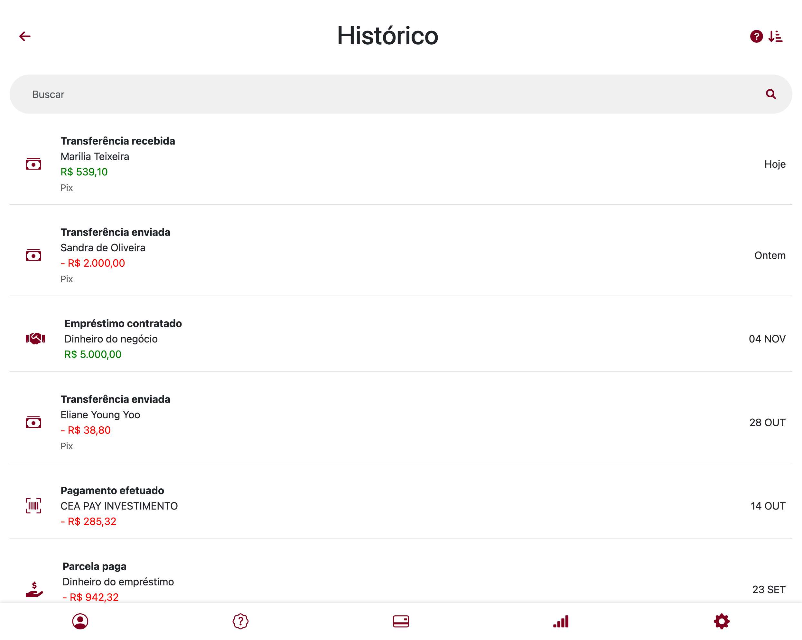

# 💼 Investment & Bank Statement JS

Simule o controle de extratos bancários e investimentos de forma simples, visual e responsiva — tudo com HTML, CSS e JavaScript puro.


---

## ✨ Sobre o projeto

Este projeto foi desenvolvido com o objetivo de simular visualmente um ambiente bancário simples, com funcionalidades de **visualização de extrato**, **entradas e saídas financeiras** e **dados simulados de investimentos**.

Ideal para quem está aprendendo JavaScript aplicado à manipulação de DOM e quer entender melhor como criar **interfaces financeiras dinâmicas** sem frameworks.

---

## 🚀 Funcionalidades

✅ Exibição de extratos bancários  
✅ Organização de dados em tabelas  
✅ Simulação de movimentações financeiras  
✅ Layout responsivo e intuitivo  
✅ Código limpo e modularizado

---

## 🖼️ Interface do Simulador





---

## 🛠 Tecnologias utilizadas

- 💻 **HTML5** — estrutura da página  
- 🎨 **CSS3** — layout e responsividade  
- ⚙️ **JavaScript** — lógica de interação e dinâmica

---

## 📂 Estrutura do projeto

```bash
InvestmentAndBankStatementJS/
│
├── pages/           # Páginas HTML
├── scripts/         # Lógica em JavaScript
├── styles/          # Estilos em CSS
├── reset.css        # Reset de estilos padrão
└── index.html       # Página principal
